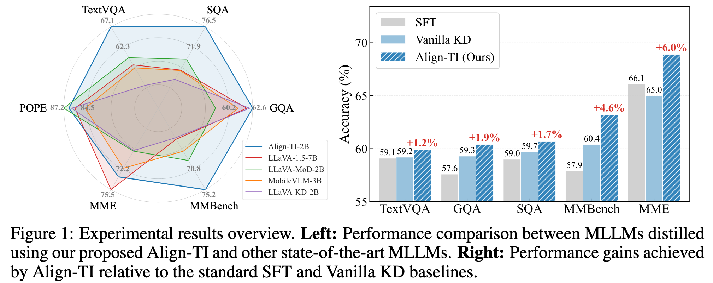

# <div align="center">Beyond Next-Token Alignment: Distilling Multimodal Large Language Models via Token Interactions<div>
<div align="center">
<!-- [](https://arxiv.org/abs/2408.15881) -->
  <a href="[https://arxiv.org/abs/2408.15881](https://arxiv.org/abs/2408.15881)"></a>
  
  [](https://github.com/lchen1019/Align-TI/LICENSE)
</div>


## 💡 Overview
Multimodal Large Language Models (MLLMs) have demonstrated impressive cross-modal understanding capabilities, yet their substantial model size poses significant challenges for widespread deployment. Knowledge distillation (KD) presents a promising solution for compressing these large-scale MLLMs. However, existing KD methods primarily rely on static next-token alignment, neglecting to model the dynamic token interactions, which embed essential capabilities for multimodal understanding and generation. To this end, we introduce **Align-TI**, a novel KD framework designed from the perspective of **T**oken **I**nteractions. Our approach is motivated by the insight that MLLMs rely on two primary interaction types: vision-instruction token interactions to extract instruction-relevant visual information, and intra-response token interactions for dynamic reasoning and coherent generation. Accordingly, Align-TI introduces two components: Instruction-aware Vision Alignment (IVA) and Transition Probability Alignment (TPA). IVA enables the student model to imitate the teacher's ability to extract instruction-relevant visual information by aligning on salient visual regions. TPA captures the teacher's dynamic generative logic by aligning the sequential token-to-token transition probabilities. Extensive experiments on standard multimodal benchmarks demonstrate the superiority of Align-TI. Notably, our approach achieves $3.7\%$ relative improvement over direct supervised fine-tuning across multiple benchmarks. Moreover, our distilled Align-TI-2B even outperforms LLaVA-1.5-7B (a much larger MLLM) by $7.0\%$, establishing a new state-of-the-art distillation framework for training parameter-efficient MLLMs.
<p align="center">
  
</p>


## 🛠️ Installation
1. Create a conda environment with `Python 3.10` or higher.
```bash
conda create -n alignti python==3.10
conda activate
```
2. Install `torch`, We recommend installing `torch==2.5.1`.
```bash
conda install pytorch==2.5.1 torchvision==0.20.1 torchaudio==2.5.1 -c pytorch
```
3. Install `transformers` and `transformer >= 4.51.0` is required for Qwen3.
```bash
pip install transformers==4.51.0
```
4. Install other packages listed in `requirements.txt`
```bash
pip install -r requirements.txt
```


## 🗂️ Data Construction
- Training Data: Please refer to [MobileVLM](https://github.com/Meituan-AutoML/MobileVLM?tab=readme-ov-file#2%EF%B8%8F%E2%83%A3-prepare-data).
- Evaluation Data: Please refer to [LLaVA](https://github.com/haotian-liu/LLaVA/blob/main/docs/Evaluation.md).

## 🚀 Evaluation
(Take evaluate ScienceQA as an example.)
- Download our CKPT and config the `MODEL_NAME` and `MODEL_PATH` in `script/eval/sqa.sh`.
- Run the evaluation script.
```bash
CUDA_VISIBLE_DEVICES=0 bash scripts/eval/sqa.sh
```
Note: If the vision encoder is not downloaded automatically, you can manually obtain it from [here](https://huggingface.co/google/siglip-so400m-patch14-384) and specify its local path in `config.json`.


## ▶️ Model Zoo
| Model                  | GQA  | SQA  | TextVQA | POPE | MME  | MMB  | CKPT |
| ---------------------- | ---- | ---- | ------- | ---- | ---- | ---- | ---- |
| LlavaQwen2-Align-TI-2B | 62.9 | 71.4 | 65.1    | 86.1 | 75.6 | 71.8 |      |
| LlavaQwen3-Align-TI-2B | 62.6 | 76.5 | 67.1    | 86.6 | 73.4 | 75.2 |      |
| LlavaQwen2-Align-TI-1B | 60.4 | 60.7 | 59.9    | 86.8 | 68.9 | 63.2 | [here](https://huggingface.co/lchen1019/LlavaQwen2-Align-TI-1B)     |
| LlavaQwen3-Align-TI-1B | 61.2 | 68.4 | 64.1    | 86.9 | 70.0 | 67.6 |      |


## 🏆 Acknowledgement
Our model is related to [LLaVA-MoD](https://github.com/haotian-liu/LLaVA) and [LLaVA-KD](https://github.com/haotian-liu/LLaVA). Thanks for their great work! We also thank great previous work including [Qwen](https://huggingface.co/Qwen), [LLaVA](https://github.com/haotian-liu/LLaVA), [MobileVLM](https://github.com/Meituan-AutoML/MobileVLM), [ShareGPT4V](https://github.com/ShareGPT4Omni/ShareGPT4V) etc.

## 📚 Citation
If you find our project useful for your research and applications, please star it and cite the paper using this BibTeX:
```BibTeX
@article{chen2025alignkd,
  title={Beyond Next-Token Alignment: Distilling Multimodal Large Language Models via Token Interactions},
  author={Chen, Lin and Zhao, Xiaoke and Ding, Kun and Feng, Weiwei and Miao, Changtao and Wang, Zili and Guowenxuan and Zheng, Kaiyuan and Zhang, Bo and Li, Zhe and Xiang, Shiming}
  journal={arXiv preprint arXiv:24xx.xxxxxx},
  year={2025}
}


